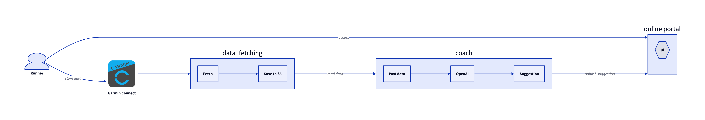

# Run tracker

Ideas of things to implement, from least to most crazy:
* Start from me, a user, going for a run and uploading data
* Uses GarminDB to get running data, maybe have this running in a Lambda every day
* Store new run results in an S3 bucket
* Extract only the intervals and report on those in a nice table too
* Use GPT-4 to predict 5k, 10k, and HM times
* Use GPT-4 to suggest my next workout
* Use Terraform to deploy the infrastructure to do the above, with a CI/CD pipeline

# Architecture diagram

(Very fast and loose, has significant errors - just an MVP)

# Developers

* Uses poetry
* Requires env variables set in `.env` file. 