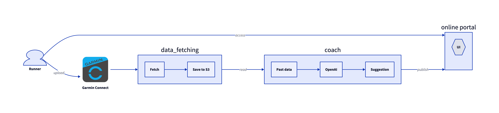

# Run tracker

This is a python application which uses [GarminDB](https://github.com/tcgoetz/GarminDB) to query my recent runs stored using Garmin Connect. The script takes all runs from the past seven days, then passes them in a prompt to `gpt-4o`, and uses these to get a coach recommended workout for today.

### Example
```
Downloading recent runs:
[{'date': '2025-03-23', 'distance': '21.26 km', 'duration': '1 hour 59 mins 18 seconds'}, {'date': '2025-03-22', 'distance': '5.59 km', 'duration': '33 mins 22 seconds'}, {'date': '2025-03-22', 'distance': '3.61 km', 'duration': '30 mins 21 seconds'}, {'date': '2025-03-19', 'distance': '7.49 km', 'duration': '40 mins 20 seconds'}, {'date': '2025-03-19', 'distance': '7.54 km', 'duration': '37 mins 3 seconds'}]

Generating a suggested workout for today:
Given the runner's recent training history, it would be best to focus on recovery and maintaining a balanced schedule. Here is a suggested workout for today:

**Workout: Easy Recovery Run**
- **Distance**: 5-6 km
- **Pace**: Comfortable and relaxed (conversation pace)
- **Duration**: Approximately 30-40 minutes

**Follow-up**:
- Cool down with 5-10 minutes of walking
- Stretch major muscle groups to aid recovery (quads, hamstrings, calves, hips)

This will help facilitate recovery from the long run while keeping the routine consistent.
```

# Architecture diagram

A rough outline of how this could look.




# Set up

Requires OpenAI API key, Garmin username and password - currently env variables set in `.env` file.

## Improvement ideas

Ideas of things to implement, from least to most crazy:
* Put this on a Flask website
* Maybe have this running in a Lambda every day, or triggered in some way
* Store new run results in an S3 bucket? Maybe not needed
* Use Terraform to deploy the infrastructure to do the above with a nice CI/CD pipeline
* Extract interval times and send them as part of the prompt, e.g. ran 8x400m at an average pace of X:.. mins/km.
* Have different coach personas (old fashioned Pete who's all about slow running, modern Steve who loves strength and conditioning, and crazy Jack who insists on an even number of kilometers per day and as a weekly total)
* Use deep research to generate some exercise science, then feed that in as part of a RAG system?
